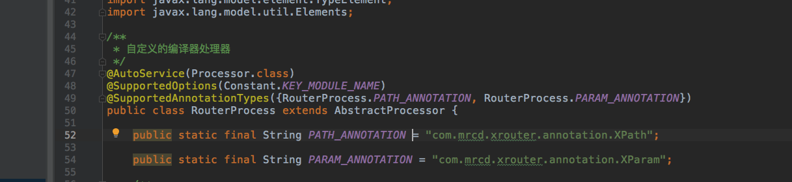

# 利用APT实现的路由XRouter

####  什么是APT

>  APT是一种处理注解的工具，确切的说它是javac的一个工具，它用来在编译时扫描和处理注解，一个注解的注解处理器，以java代码(或者编译过的字节码)作为输入，生成.java文件作为输出，核心是交给自己定义的处理器去处理。    

####  什么是注解
>  注解（Annotation）是Java5的一个新特性,是插入在代码中的一种注释或者说是一种元数据（meta data），这些注释信息可以在编译期使用预编译工具进行获取处理，也可以在运行期使用Java反射机制来获取，这取决于你的注解类型。

####  XRouter的实现

1.  通过执行编译操作，利用APT在编译器将Activity的相关信息收集起来，以Json的形式存储在本地文件中
2.  编写gradle插件，执行相关task读取本地的Json文件，获取Activity信息
3.  在插件中根据读取到的Activity信息，通过Javapoet动态生成对应的路由文件
4.  [使用说明](https://github.com/xuxingchen2018/XRouter)  

#####  Library说明

1.  xrouter-annotation，定义路由所需要的相关注解，XPath，XParam等
2.  xrouter-compiler，包含自定义注解处理器RouterProcess，收集路由信息；编译期生成绑定数据的类——DataBinder
3.  xrouter-api，定义路由的基础实现，XRouter是基于此库进行了封装
4.  xrouter-gradle-plugin，gradle插件库，用于读取本地Json，生成路由文件

*  为什么annotation与compiler要分离?

    processor只在编译期有用，对于运行期时，processor没有真实作用，而annotation注解在运行时有可能会使用，至少也是在class中会用到，所以无论是在class，或者是运行时，都已经与processor没有关系了，如果引入了，不仅没什么作用，反而会增加APP的方法数

*  如何自定义Processor？

   <div align=center></div>
   
   AutoService主要的作用是注解 processor 类，并对其生成 META-INF 的配置信息
   SupportedOptions作用是增加支持的option配置项，在build.gradle文件中增加option项
   ```
   javaCompileOptions { annotationProcessorOptions { arguments = [MODULE_NAME: project.getName()] } }
   ```
   SupportedAnnotationTypes表示注解处理器所支持的注解类型 
   
*  如何编写Gradle插件？

   [Gradle 官方说明](https://docs.gradle.org/current/userguide/custom_plugins.html)

